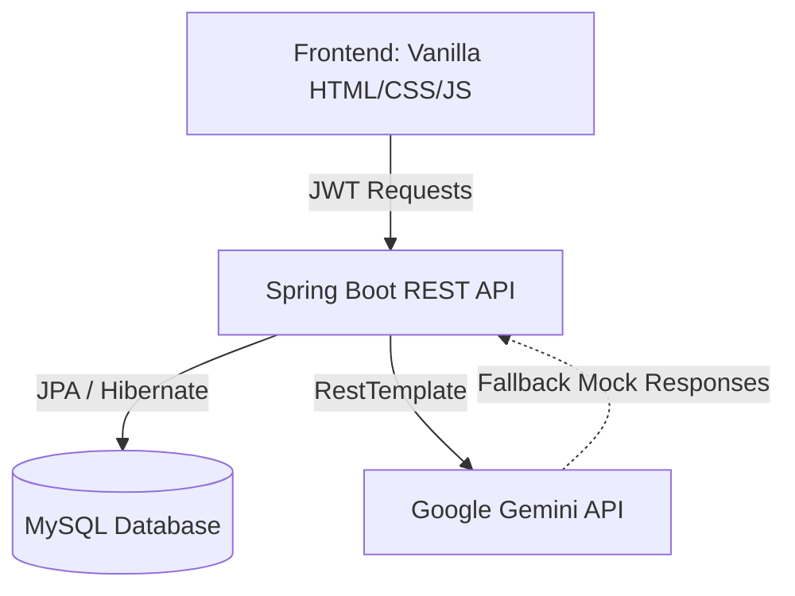

# AI Multi-Agent Code Assistant

An advanced AI-powered pair programming and analytics platform consisting of three specialized agentic developer tools: **Code Generation**, **Code Review**, and **Code Explanation**. Built using a premium, high-fidelity Glassmorphic UI (Vanilla HTML/CSS/JS) and a robust, secure REST API backend (Spring Boot & JWT).

---

## Technical Architecture



### Folder Structure
```text
AI-Multi-Agent/
├── backend/
│   ├── src/main/java/
│   │   └── com/multiagent/codeassistant/
│   │       ├── config/        # Boot configuration
│   │       ├── security/      # Security filters & Details
│   │       ├── jwt/           # Token crypt provider
│   │       ├── controller/    # REST endpoints
│   │       ├── service/       # Business & Gemini services
│   │       ├── repository/    # Database queries JPA
│   │       ├── model/         # User & History entities
│   │       ├── dto/           # Request/Response payloads
│   │       └── exception/     # Global error handling
│   ├── src/main/resources/
│   │   ├── application.properties
│   │   ├── schema.sql
│   │   ├── openapi.json
│   │   └── postman_collection.json
│   └── pom.xml
├── frontend/
│   ├── css/                  # common, theme, page styles
│   ├── js/                   # api, auth, dashboard modules
│   └── *.html                # Dashboard & feature pages
└── README.md
```

---

## Features

1.  **AI Code Generator**: Generates modular, documented code based on natural language requirements across multiple languages (Java, Python, C++, SQL, JavaScript, HTML, CSS).
2.  **AI Code Reviewer**: Analyzes snippets for bugs, security vulnerabilities, performant loops, and style smells. Includes side-by-side optimization panels.
3.  **AI Code Explainer**: Breaks down complex algorithms line-by-line, analyzes time/space complexities, and maps them to real-world analogies.
4.  **Glassmorphism Dashboard**: Fully responsive ChatGPT-like panel featuring request stats, dynamic graphs, user profile editing, security settings, and request history pagination.

---

## API Endpoints

### Authentication
*   `POST /api/auth/signup` - Register a new account.
*   `POST /api/auth/login` - Authenticate credentials and receive a JWT.

### User Details
*   `GET /api/user/profile` - Fetch profile stats and total counts.
*   `PUT /api/user/profile` - Modify name or change password.

### AI Agents
*   `POST /api/generate` - Instruct the Code Generator.
*   `POST /api/review` - Instruct the Code Reviewer.
*   `POST /api/explain` - Instruct the Code Explainer.

### Logs
*   `GET /api/history` - Retrieve request log history.
*   `DELETE /api/history/{id}` - Remove a specific log.

---

## Getting Started

### 1. Database Configuration
Ensure MySQL is running and create a database named `ai_multi_agent`:
```sql
CREATE DATABASE ai_multi_agent;
```
Configure your credentials in `backend/src/main/resources/application.properties` or set environment variables:
*   `SPRING_DATASOURCE_USERNAME` (Default: `root`)
*   `SPRING_DATASOURCE_PASSWORD` (Default: empty)

### 2. Run the Backend
Navigate to the `backend/` folder and execute Maven:
```bash
mvn clean compile
mvn spring-boot:run
```
*(If no `GEMINI_API_KEY` is configured in your environment variables, the backend will gracefully run using high-quality simulated mock responses).*

### 3. Run the Frontend
Simply open `frontend/index.html` using a browser, or run a local web server (e.g. VS Code Live Server) on port `5500`.

---

## Supplementary Assets
*   **Postman Collection**: Location at [postman_collection.json](file:///C:/Project/AI%20Multi%20Agent/backend/src/main/resources/postman_collection.json). Import this collection into Postman for instant manual testing.
*   **OpenAPI Documentation**: Location at [openapi.json](file:///C:/Project/AI%20Multi%20Agent/backend/src/main/resources/openapi.json). Use Swagger editor or local rendering to view API structures.
